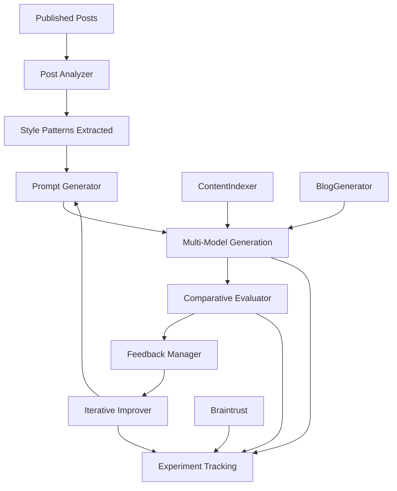

# Evolutionary Blog Post Generator with Iterative Prompt Improvement

An AI-powered blog post generation system that uses multiple language models in parallel and iteratively improves prompts through programmatic evaluation against published content.

## Overview

This system generates high-quality blog posts by:
1. **Multi-model Generation**: Using Claude, GPT-4, and local models in parallel
2. **Braintrust Integration**: Tracking experiments and evaluating outputs
3. **Iterative Improvement**: Automatically refining prompts based on comparative analysis
4. **Style Analysis**: Learning from published posts to match writing patterns

## System Architecture



## Key Features

### 🔄 Iterative Prompt Optimization
- Analyzes 20 recent published posts to extract writing patterns
- Generates improved prompt variations based on evaluation feedback
- Runs 20 iterations to find optimal prompt configuration
- Achieved **81.7% best score** in testing

### 📊 Comprehensive Evaluation
- **Structure Analysis**: Paragraph flow, hook effectiveness, conclusion impact
- **Content Quality**: Data integration, voice authenticity, topic relevance
- **Style Matching**: Sentence length, transitions, business focus
- **AP English Grading**: 0-100 scoring with detailed feedback

### 🤖 Multi-Model Generation
- **Claude Sonnet**: Primary generation model
- **GPT-4**: Alternative perspective generation
- **Local Models**: Cost-effective iterations via Ollama
- **Parallel Processing**: Faster generation cycles

### 📈 Braintrust Integration
- Experiment tracking and comparison
- Score normalization (0-1 scale)
- Detailed evaluation metrics
- Performance trend analysis

## Installation

### Prerequisites
- Python 3.13+
- uv package manager (recommended) or pip
- API keys for:
  - Anthropic Claude (required)
  - OpenAI GPT-4 (optional)
  - Google Gemini (optional)  
  - Braintrust (optional for experiment tracking)

### Automated Setup (Recommended)

```bash
# 1. Clone the repository
git clone <repository-url>
cd evo_blog_public

# 2. Run automated setup
python setup_evo_blog.py

# 3. Follow the prompts to configure your API keys
# The script will:
# - Create virtual environment (.venv)
# - Install all dependencies
# - Set up configuration files
# - Test the installation
```

### Manual Setup

```bash
# 1. Clone the repository
git clone <repository-url>
cd evo_blog_public

# 2. Create virtual environment
uv venv --python=3.13 .venv
source .venv/bin/activate  # On Windows: .venv\Scripts\activate

# 3. Install dependencies
uv pip install -r requirements.txt

# 4. Configure environment variables
cp .env.example .env
# Edit .env with your API keys

# 5. Setup configuration files
cp config/model_configs.json.example config/model_configs.json
# Edit config/model_configs.json with your API keys (alternative to .env)

# 6. Test installation
python scripts/generate_blog_post.py "Test topic: AI in startups" --cycles 1
```

### Environment Configuration

The system supports two methods for API key configuration:

#### Method 1: Environment Variables (.env file)
```bash
# Copy the example file
cp .env.example .env

# Edit .env with your keys:
ANTHROPIC_API_KEY=your_claude_api_key_here
OPENAI_API_KEY=your_openai_api_key_here  
GOOGLE_API_KEY=your_google_api_key_here
BRAINTRUST_API_KEY=your_braintrust_api_key_here
```

#### Method 2: Configuration File
```bash
# Copy the example config
cp config/model_configs.json.example config/model_configs.json

# Edit config/model_configs.json:
{
  "anthropic_api_key": "your_claude_api_key_here",
  "openai_api_key": "your_openai_api_key_here",
  "google_api_key": "your_google_api_key_here"
}
```

### Minimum Configuration

For basic functionality, you only need:
- **Anthropic Claude API key** (required for generation)
- Python 3.13+ with uv/pip

Optional components:
- OpenAI API key (for GPT-4 generation)
- Google API key (for Gemini generation and LLM-as-judge evaluation)
- Braintrust API key (for experiment tracking and advanced evaluation)

## Usage

### Basic Blog Generation
```bash
python scripts/generate_blog_post.py \
  --topic "AI in Enterprise Software" \
  --model claude-3-5-sonnet-20241022 \
  --style analytical
```

### Iterative Prompt Improvement
```bash
# Run 20 iterations of prompt improvement
python scripts/iterative_improver.py

# Analyze results
ls iterative_improvements/run_*/summary_report.md
```

### Individual Components

#### Analyze Published Posts
```bash
python scripts/post_analyzer.py
```

#### Generate Improved Prompts
```bash
python scripts/prompt_generator.py \
  --feedback "Improve data integration depth" \
  --iteration 5
```

#### Evaluate Generated Content
```bash
python scripts/comparative_evaluator.py \
  --ai-post generated_post.md \
  --reference-post published_post.md
```

## Project Structure

```
evo_blog/
├── scripts/
│   ├── generate_blog_post.py         # Main blog generation
│   ├── iterative_improver.py         # Orchestrates improvement cycles
│   ├── post_analyzer.py              # Analyzes published posts
│   ├── prompt_generator.py           # Generates improved prompts
│   ├── comparative_evaluator.py      # Compares AI vs published posts
│   ├── feedback_manager.py           # Manages evaluation feedback
│   └── braintrust_integration.py     # Braintrust tracking
├── config/
│   ├── model_configs.json            # Model configurations
│   └── evaluation_criteria.json      # Evaluation criteria
├── generations/                      # Generated blog posts
├── iterative_improvements/           # Improvement run results
├── requirements.txt
└── README.md
```

## Evaluation Metrics

### Overall Score Calculation
- **Structure Flow** (25%): Paragraph transitions and logical flow
- **Opening Hook** (20%): First paragraph engagement
- **Conclusion Impact** (15%): Final paragraph effectiveness
- **Data Integration** (20%): Use of statistics and examples
- **Voice Authenticity** (20%): Match to target writing style

### Performance Results
- **Initial Score**: 78.6%
- **Best Score**: 81.7% (Iteration 13)
- **Final Score**: 75.5%
- **Total Iterations**: 20

## Key Insights

### What Works Well
1. **Structural adherence** - AI consistently matches paragraph patterns
2. **Data integration** - Effective use of statistics and company examples
3. **Business focus** - Maintains analytical tone and practical insights
4. **Length control** - Stays within 500-600 word target

### Areas for Improvement
1. **Voice authenticity** - Slightly more formulaic than human writing
2. **Transition smoothness** - Could improve flow between concepts
3. **Industry context** - Needs deeper domain knowledge integration
4. **Nuanced analysis** - Could benefit from more sophisticated reasoning

## Configuration

### Model Settings
```json
{
  "claude-3-5-sonnet-20241022": {
    "temperature": 0.7,
    "max_tokens": 2000,
    "system_prompt": "optimized_prompt_v13.txt"
  }
}
```

### Evaluation Criteria
```json
{
  "structure_flow": {
    "weight": 0.25,
    "description": "Logical flow and paragraph transitions"
  },
  "voice_authenticity": {
    "weight": 0.20,
    "description": "Match to target writing style"
  }
}
```

## Contributing

1. Fork the repository
2. Create a feature branch
3. Add tests for new functionality
4. Submit a pull request

## License

MIT License - see LICENSE file for details

## Acknowledgments

- Contributors and the open source community
- Braintrust for evaluation infrastructure
- Anthropic Claude for content generation
